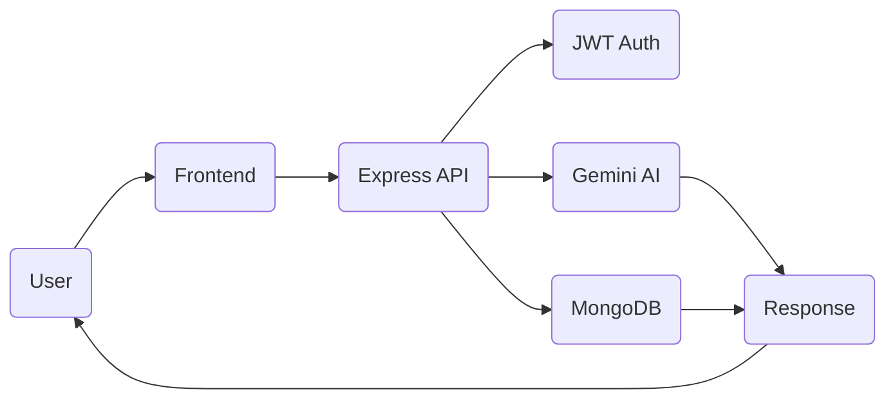

# 🌿 Serenity — AI Stress Management Chatbot

<div align="center">

# 🌿 Serenity

### *Your AI-Powered Mental Wellness Companion*


*A secure AI chatbot focused on supportive conversations, stress management, and modern web security.*

</div>

---

## 📚 Table of Contents
- Overview
- Features
- Architecture
- Tech Stack
- Project Structure
- Installation
- Environment Variables
- Security
- Workflow
- API Overview
- Roadmap
- Contributing
- License

---

# 🌸 Overview

Serenity is an AI-powered mental wellness chatbot built using **Node.js**, **Express**, **MongoDB Atlas**, and **Google Gemini AI**. It combines secure authentication with conversational AI to provide users with a supportive environment for everyday wellness conversations.

---

# ✨ Features

- 🤖 Google Gemini AI conversations
- 🔐 JWT authentication
- 🔒 Password hashing with bcrypt
- 📊 MongoDB Atlas storage
- 🛡️ Rate limiting
- ✅ Request validation
- 🌐 REST API backend
- 💻 Responsive frontend
- 🚀 Fast Express server

---

# 🏗️ Architecture



---

# ⚙️ Tech Stack

| Layer | Technology |
|------|------------|
| Frontend | HTML, CSS, JavaScript |
| Backend | Node.js + Express |
| AI | Google Gemini |
| Database | MongoDB Atlas |
| Security | JWT, bcryptjs |
| Validation | express-validator |
| Protection | express-rate-limit, CORS |

---

# 📂 Project Structure

```text
serenity-chatbot/
├── backend/
│   ├── middleware/
│   ├── models/
│   ├── server.js
│   ├── package.json
│   └── .env
├── app.js
├── index.html
├── style.css
├── package.json
├── README.md
└── .gitignore
```

---

# 🚀 Installation

```bash
git clone https://github.com/rattaneshguleria/serenity-chatbot.git
cd serenity-chatbot
cd backend
npm install
npm start
```

Open the frontend using Live Server.

---

# 🔑 Environment Variables

```env
PORT=5000
MONGODB_URI=your_mongodb_connection
JWT_SECRET=your_secret
GEMINI_API_KEY=your_api_key
FRONTEND_URL=http://localhost:5500
```

---

# 🔐 Security

- JWT Authentication
- Password Hashing
- Input Validation
- Rate Limiting
- Protected Routes
- CORS

---

# 🔄 Request Flow

```text
User
 ↓
Frontend
 ↓
Express API
 ↓
Authentication
 ↓
Gemini AI
 ↓
Database
 ↓
Response
```

---

# 📡 API Overview

| Method | Endpoint | Purpose |
|-------|----------|---------|
| POST | /register | Register user |
| POST | /login | Authenticate |
| POST | /chat | Generate AI response |

> Adjust endpoint names if they differ in your implementation.

---

# 🛣️ Roadmap

- Voice conversations
- Mood analytics
- Daily wellness reminders
- Conversation history
- Multi-language support
- Mobile application

---

# 🤝 Contributing

Fork → Branch → Commit → Push → Pull Request.

---

# 📜 License

MIT License.

---

# 👨‍💻 Developer

**Rattanesh Guleria**  
B.Tech Computer Science Engineering  
Lovely Professional University

GitHub: https://github.com/rattaneshguleria

---

<div align="center">

## ⭐ Star this repository if you found it useful!

*Building supportive AI experiences with secure web technologies.*

</div>
